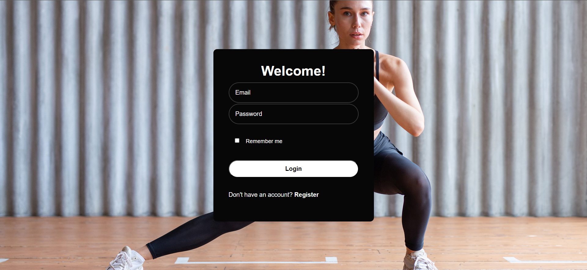

# Titans Training // Group Project 02
The **Titans Training** web application assists users in generating custom workout routines with just a few clicks of a button. Simply create an account, fill out a brief questionnaire, and then enjoy a curated list of exercises tailor-made to help them achieve their health and fitness goals.

## Application Features
- Users can create and login to their personal accounts, where they can start generating curated workout plans from their dashboard.

- Upon filling out the web application's brief questionaire, users can then generate their personalized workouts from their dashboard page. 

- Users can regenerate their list of wrokouts as many times as they like by utilizing the application's **"Regenerate Workout"** button.

## User Story
 - As a person interested in exercising, I would like to be able to find workouts that I can utilize to achieve my specific health and fitness goals.

## Acceptance Criteria
- WHEN I open the Titans Training application, 

- THEN I am prompted with a login page where I can login to be user account or choose to register a new one.

- WHEN I register a user account within the Titans Training application, 

- THEN I am taken to the application dashboard, 

- WHEN I answer all required questions within the workout questionaire, 

- THEN I am given a curated list of exercises that match the specific parameters that I queried for on the questionaire. 

- WHEN I click on the **"Regenerate Workout"** button,

- THEN I given another unique list of exercises still matching the specific parameters that I queried for on the questionaire. 

- WHEN I click on the **"Logout"** button,

- THEN I will be logged out of my user account and returned to the Titans Training login page. 

## Technologies Used
- HTML / CSS / JavaScript

- API Ninja

- boxicons

- Node.js

- Express.js

- mySQL

- Sequelize

- Handlebars.js

- bcrypt

## Live Application / Code Repo

**Live**: https://group9-workout-app-6a2c79670d32.herokuapp.com/

**GitHub Repo**: https://github.com/josegueraweb/workout-app/tree/main

## Mock-Up
**Login Page**

**Workout Questionaire**

**Generate List of Workouts**

**Register Page**

